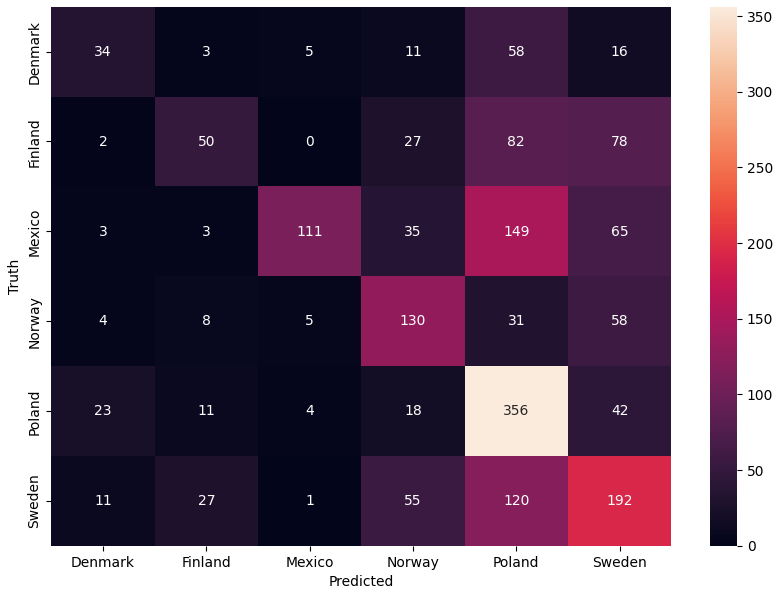
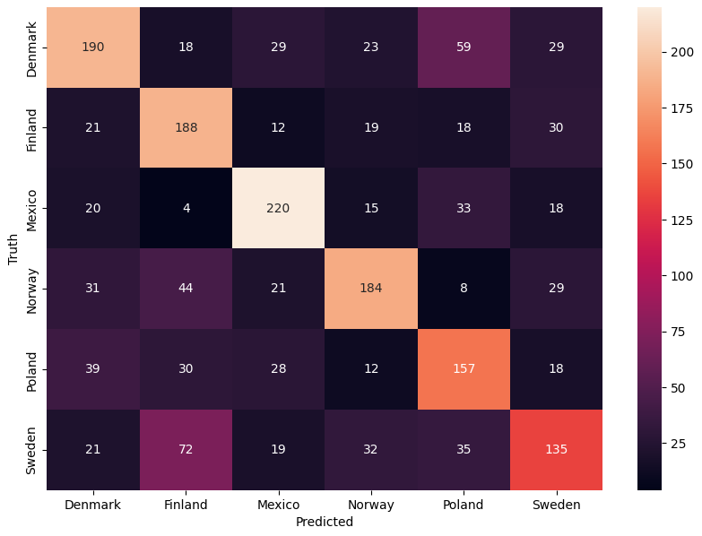
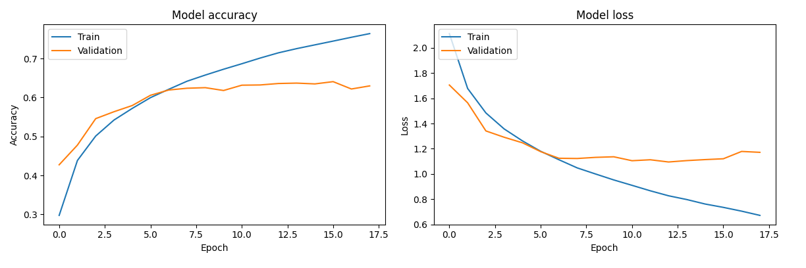
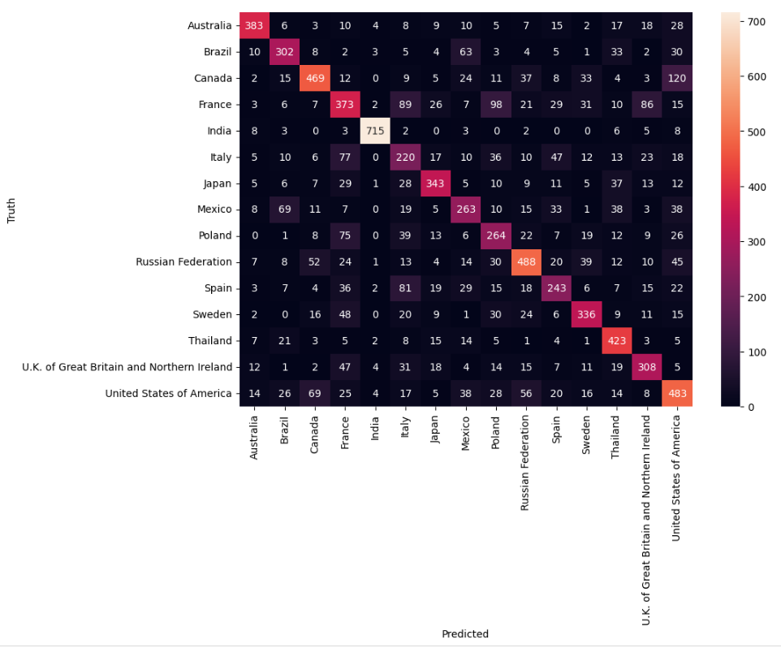

# NN


---

## Running the Image Classifier with Map Visualization

This application uses tkinter for GUI, a trained TensorFlow Keras model for image classification, and Cartopy for map visualization. The application displays images of countries and their corresponding predictions, along with their locations marked on a world map.

### Prerequisites

- Python 3.x installed on your system.
- pip package manager installed.

### Installation

1. Clone or download the repository to your local machine.

2. Navigate to the project directory in your terminal.

3. Install the required Python packages using the following command:
   
   ```
   pip install -r requirements.txt
   ```

### Running the Application

1. After installing the required dependencies, execute the following command in your terminal to run the application:

   ```
   python srcpy\ShowGuesses.py
   ```

2. The application window will appear, displaying images of countries and their predictions. You can navigate through the images using the "Next" and "Previous" buttons, or enable auto play.

3. The map on the right side of the window shows the location of the country corresponding to the displayed image.

4. Click the "Quit" button or close the window to exit the application.

<br></br>

## Logging


### v1.0
Basic NN with python and scraping down MNIST number dataset. The NN used 2 hidden layers with 128 and 64 nodes each. The activation function used in all layers is currently sigmoid. Able to get 95.4% accuracy on the data set with ~5 minutes of training.


### v1.1
Pairing up and sorting the labeling of the images. devideImages.py also standardizes the aspect ratio and lowers the quality of the images to make it easier for the AI to learn.


### v1.2
Made a short script plotting out the coordinates from all the photospheres from the dataset. This is the result from that:


In order to know what country it is from I will need to download the border data from all countries in the world and check what country the coordinate is in.


The country's borders are made up of one or more polygons. In total there are 2010 of these polygons. To check in what country a coordinate is in I for every coordinate loop through the polygons and check if the coordinate is in that polygon. The country outline data although does not have infinite precision, because of this a location that is inside a country can count as not in any country. To solve this issue, whenever a coordinate is not in a country, it will be counted as in the closest country given by the closest polygon.


There are still some issues with this program that were fixed accordingly. If a country is completely encapsulated in **one** other country, the locations will sometimes be counted as in the outer country instead (This is because the coordinates are inside the bigger country's polygon and its own polygon). There are multiple examples of these exclaves in the world: Belgium, Netherlands; Switzerland, Germany; India, Bangladesh and South Africa, Lesotho. All of these examples except South Africa, Lesotho are too small for my borders data to notice. To fix the issue, whenever a coordinate is in South Africa, the program will wait and see if it is in Lesotho too.


The second problem was that the code would take almost an hour to run on the data. To fix the problem I changed the order in which the code checks the polygons. The code dynamically changes the order it checks polygons in determined by how often the polygon has had a coordinate in it. This optimization brough the code down from an hour to about 5 minutes.


Here are the plotted result:


Here are the most popular countries:


### v1.3

Made a script that takes in the photospheres and transforms them into normal FOV images. The code also places the new images in folders train, test and val which all contain country folders with the corresponding image in them. 70% of the images are placed in the train folder, 15% in the val and the remaining 15% in the test subfolder. The code was very slow and would originally take almost 16 hours to run. To make it faster I used multithreading, with this the code only took about 4 hours to run. Here are some progress images:


### v1.4

Since some countries have more images than others, my model started to guess those countries much more just because they are more frequent. To fix this I added some images more than once and some not at all to keep an equal amount of images from all countries. 

Without equal amount of images:




With equal amount of images:



### v1.5

The model became overfit, only guessing the more frequent countries when a country has too little images compared to others. To compansate this i added more copies of some images to have an equal amount of images from each country. This although, created a brand new problem. Countries that originally only had a few images now will have alot images that are exactally the same. This will overfit the model to those images. To fix this issue I randomly changed the pan and zoom on all images so even the duplicate images are distinct. This solution will hopefully help the model find actual patterns to countries. I mostly faced these problems when I tried to guess what Brazilian state a image was taken in, in this case some states only had a handful images while others had over a thousand.  

The following images are from the trained model with 15 different countries with 5000 images each.

Preformance plot:



Confusion matrix:



### v1.6
