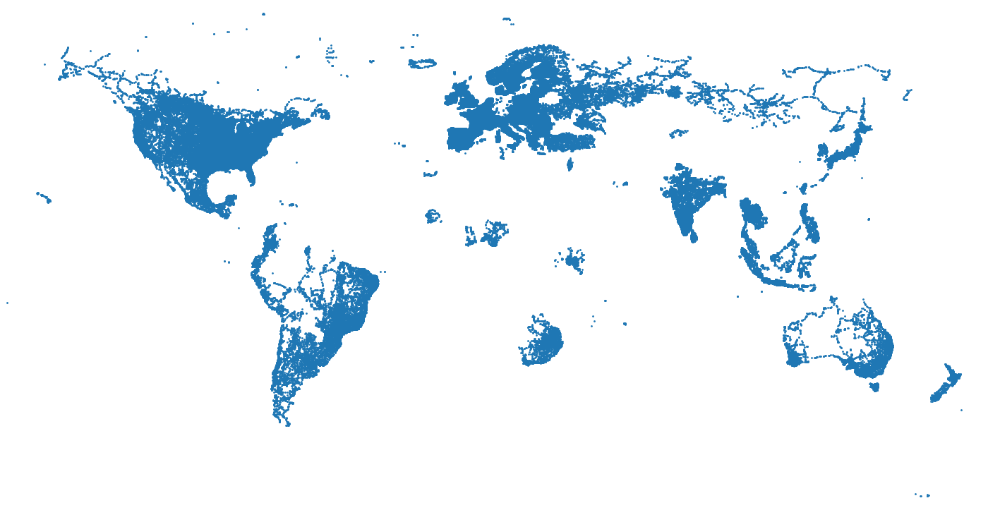
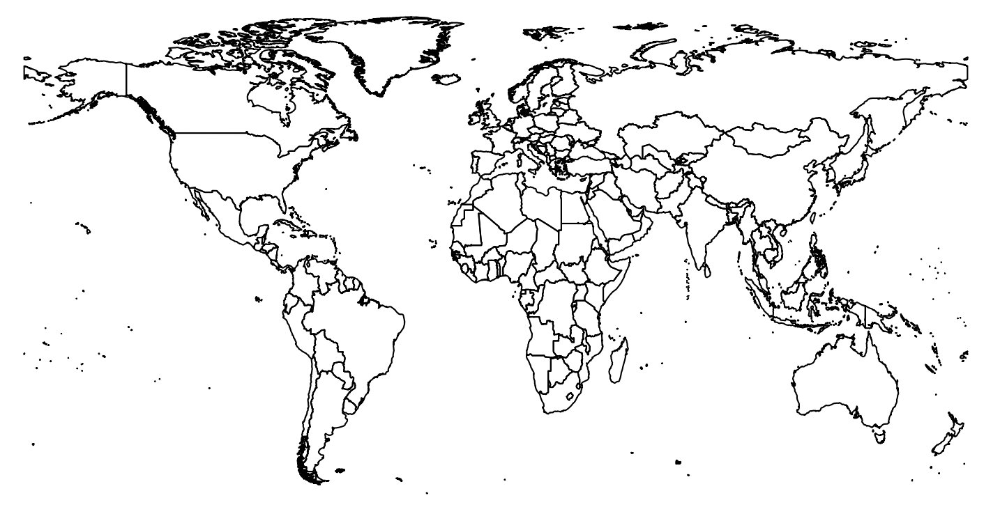
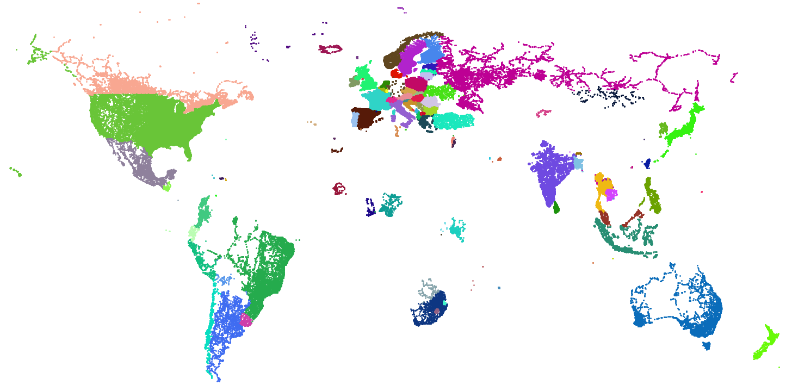
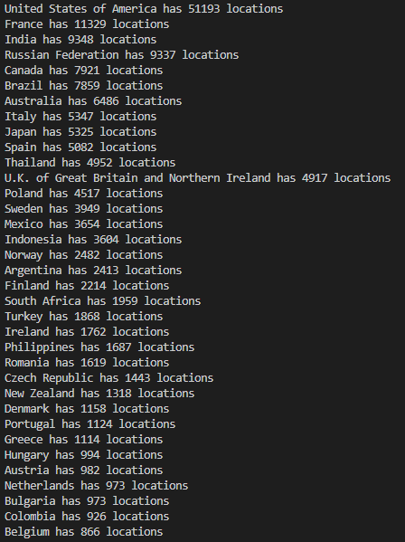
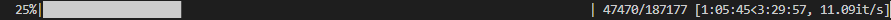
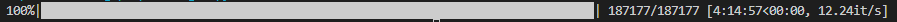

# NN

## Logging

### v1.0
Basic NN with python and scraping down MNIST number dataset. The NN used 2 hidden layers with 128 and 64 nodes each. The activation function used in all layers is currently sigmoid. Able to get 95.4% accuracy on the data set with ~5 minutes of training.

~5 hours

### v1.1
Pairing up and sorting the labeling of the images. devideImages.py also standardizes the aspect ratio and lowers the quality of the images to make it easier for the AI to learn.

~4 hours

### v1.2
Made a short script plotting out the coordinates from all the photospheres from the dataset. This is the result from that:

In order to know what country it is from I will need to download the border data from all countries in the world and check what country the coordinate is in.

The country's borders are made up of one or more polygons. In total there are 2010 of these polygons. To check in what country a coordinate is in I for every coordinate loop through the polygons and check if the coordinate is in that polygon. The country outline data although does not have infinite precision, because of this a location that is inside a country can count as not in any country. To solve this issue, whenever a coordinate is not in a country, it will be counted as in the closest country given by the closest polygon.

There are still some issues with this program that were fixed accordingly. If a country is completely encapsulated in **one** other country, the locations will sometimes be counted as in the outer country instead (This is because the coordinates are inside the bigger country's polygon and its own polygon). There are multiple examples of these exclaves in the world: Belgium, Netherlands; Switzerland, Germany; India, Bangladesh and South Africa, Lesotho. All of these examples except South Africa, Lesotho are too small for my borders data to notice. To fix the issue, whenever a coordinate is in South Africa, the program will wait and see if it is in Lesotho too.

The second problem was that the code would take almost an hour to run on the data. To fix the problem I changed the order in which the code checks the polygons. The code dynamically changes the order it checks polygons in determined by how often the polygon has had a coordinate in it. This optimization brough the code down from an hour to about 5 minutes.

Here are the plotted result:

Here are the most popular countries:

~8 hours

### v1.3

Made a script that takes in the photospheres and transforms them into normal FOV images. The code also places the new images in folders train, test and val which all contain country folders with the corresponding image in them. 70% of the images are placed in the train folder, 15% in the val and the remaining 15% in the test subfolder. The code was very slow and would originally take almost 16 hours to run. To make it faster I used multithreading, with this the code only took about 4 hours to run. Here are some progress images:

~3 hours
